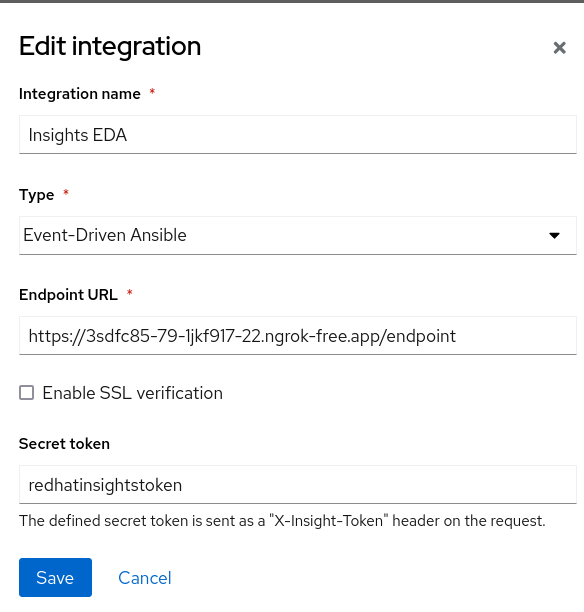
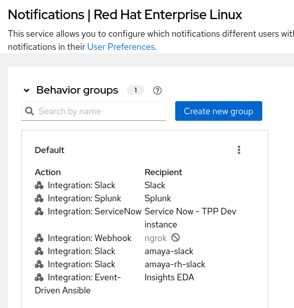
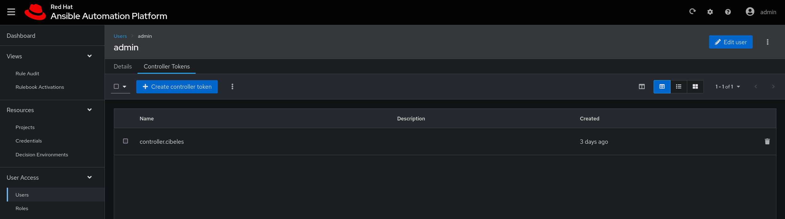
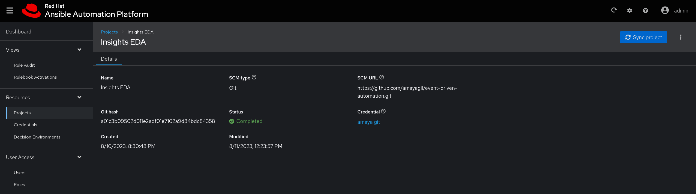
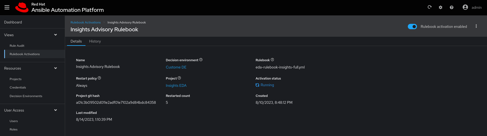
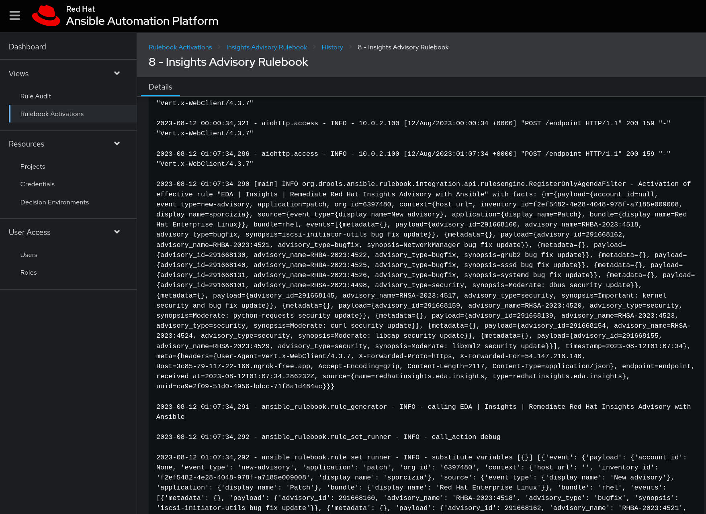

# Introducing Ansible Event Driven Automation

This repo shows a demo to showcase event driven automation using ansible and rulebooks.

The rulebook instantiates one listener: Red Hat Insights events []()
 covering two different use cases, CVE remediation and malware detection and ticket creation in Service Now.

Each of those listeners react to events, trying to remediate an alert triggered by the application via playbooks that are part of the demo.

Events are generated by a Red Hat Insights service, listening on port *5002* on localhost, that exposes the following endpoints

    /insights

## Requirements

To run the demo, **podman** and **podman-compose** should be installed in your system. Yes, nothing more! :)

Follow the instructions to install them, based on your system.

[Podman setup](https://podman.io/getting-started/installation)

[podman-compose setup](https://github.com/containers/podman-compose)

## Components

The stack is composed by one container:

- Ansible EDA container image, running the ansible bits

The *eda-ansible* directory, all rulebooks and playbooks are present.

The *playbooks* directory, where the playbooks containing the actions to be taken to an event are, in this case:
- *eda-playbook-insights-cve.yml*
- *eda-playbook-insights-fix.yml*
- *eda-playbook-insights-malware.yml*
- *eda-playbook-insights-telegram.yml*
- *eda-playbook-insights-simple.yml*

## Configuring Red Hat Insights to emit events

You can find a brief guide to configure Red Hat Insights to emit event notifications [in this blog post](https://www.ansible.com/blog/using-red-hat-insights-as-a-source-of-events-for-event-driven-ansible-automation).

I will sum up the needed steps bellow, but please do read Jerome's blog for further understanding.

### Integrate Insights and EDA

#### Integration on the Insights console side

You do need to integrate EDA with Insights, in order to do that, your EDA machine (the one processing the events) needs to have connection to internet and be reachable from the exterior. In my case, I don't have that (using a machine on my home lab behind NAT router) so the solution is to use [*ngrok*](https://ngrok.com).

The best way to configure ngrok in your EDA machine is [as a service](https://ngrok.com/docs/secure-tunnels/ngrok-agent/installing-as-a-service/). 

The most important thing to configure here, is the [configuration file](https://ngrok.com/docs/secure-tunnels/ngrok-agent/reference/config/), here's a basic example that works with this demo:

```
[root@eda ~]# cat ngrok.yml 
# in ngrok.yml
authtoken: Abd2M6FgBt7k87204757BSEdMm3uGFGVdfd935V
log_level: info
log_format: term
log: stdout
region: eu
version: 2
tunnels:
  insights:
    proto: http
    addr: 5002
```

Then you should log into your Red Hat Insights console and go to integrations:



Now, you need to add the ‘Insights EDA’ endpoint so that it can be used as an action in a behavior group notification in Settings > Notifications, for example:



#### Integration on the Automation controller

Once your setup is in place, you need to generate a token, that will be used by EDA Controller to connect to the Automation Controller. To do so, you can go in the **Users -> admin -> Token** section in the controller and *ADD*  a new token.


#### Integration on the EDA machine

Save the token and open the EDA Controller URL, go in the **Users -> admin -> Token** section and *Create controller token*



Then, you need to configure your project, in my case, my project files are in github. For that, go to **Resources -> Projects ** section and *Create project*



Then, you will also need to configure a rulebook activation, that is the listener. Go to **Views -> Rulebook Activations ** section and *Create rulebook activation*



Once your objects are in place, you can go to **Views -> Rulebook Activations ** section and *Your rulebook activation -> History* and you will see the events coming:



Alternatively, you can use the [configure-controller-token playbook](./eda-controller-setup/configure-controller-token.yml)

To configure the predefined project, credentials and templates, you can use the playbooks located in the [eda-controller-setup directory](./eda-controller-setup/).

The *configure-aap-controller* playbook, requires an ansible-galaxy configuration that allows accessing [Red Hat Automation Hub](https://access.redhat.com/documentation/en-us/red_hat_ansible_automation_platform/2.4/html-single/getting_started_with_automation_hub/index)

First, install the requirements:

    ansible-galaxy install -r requirements.yml

Tune up the [eda-vars.yml file](./eda-controller-setup/eda-vars.yml) to match your setup, the relevant settings (and self-explanatory) are:

    aap2_controller_host:
    aap2_controller_username:
    aap2_controller_password:

    eda_controller_url:
    eda_controller_user:
    eda_controller_password:

    servicenow_instance_url:
    servicenow_instance_user:
    servicenow_instance_password:

These variables will be used to configure both the AAP2 Controller and the EDA Controller.

You can then run the two playbooks to complete the configuration.

    ansible-playbook configure-aap-controller.yml
    ansible-playbook configure-eda-controller.yml

### Decision Environment

Decision environments are a container image to run Ansible rulebooks. They create a common language for communicating automation dependencies, and provide a standard way to build and distribute the automation environment. The default decision environment is found in the Ansible-Rulebook. 

You can create your own decision environment to use with EDA. More information can be found in the official [documentation](https://access.redhat.com/documentation/en-us/red_hat_ansible_automation_platform/2.4/html/event-driven_ansible_controller_user_guide/eda-decision-environments).

This demo uses a custom DE, you can learn more about it at [kubealex' gh](https://github.com/kubealex/eda-decision-environment).